<table align="center"><tr><td align="center" width="9999"><br>


# Unidade Curricular:  Projeto Integrador 3 

<b>Instituto Federal de Educação, Ciência e Tecnologia de Santa Catarina<br>
Campus Florianópolis<br></b>
**Professor:**  Robinson Pizzio e Matheus Leitzke Pinto<br>
**Alunos:**  Alexsander Vieira e Jonathan Chrysostomo Cabral Bonette<br>
</td></tr></table>

* [1. Introdução](#1-introdução)
* [2. Requisitos](#2-requisitos)
* [3. Lista de Componentes](#3-lista-de-componentes)
* [4. Montagem do Hardware](#4-montagem-do-hardware)
* [5. Configuração do Software](#5-configuração-do-software)
* [6. Funcionalidades Implementadas](#6-funcionalidades-implementadas)
* [7. Desafios e Aprendizados](#7-desafios-e-aprendizados)
* [8. Próximos Passos e Melhorias Futuras](#8-próximos-passos-e-melhorias-futuras)
* [9. Conclusão](#9-conclusão)
* [10. Referências](#10-referências)


## 1. Introdução

### Objetivo do Projeto
O Espelho Inteligente é um projeto inovador que combina tecnologia e praticidade, transformando um espelho comum em uma interface inteligente e interativa. O propósito do projeto é integrar informações úteis e personalizadas diretamente na superfície do espelho, permitindo ao usuário acessar uma variedade de serviços enquanto realiza suas atividades cotidianas, como se arrumar para o dia ou se preparar para dormir.

Este projeto foi desenvolvido com foco em automação residencial, personalização e aprendizado prático com dispositivos como o Raspberry Pi. A ideia central é proporcionar uma experiência de usuário que seja funcional e informativa, tornando as rotinas diárias mais eficientes e conectadas. Além disso, o desenvolvimento do Espelho Inteligente oferece uma oportunidade única para explorar e aplicar conhecimentos de programação, eletrônica e design de interfaces.

### Descrição Geral

O Espelho Inteligente é uma interface digital refletiva composta por componentes como um monitor, um Raspberry Pi, uma película reflexiva, sensores e uma moldura de madeira. Ele funciona como um "dashboard" que exibe informações variadas, como hora, calendário, previsão do tempo, notícias, e até notificações personalizadas. A integração de módulos configuráveis permite que o espelho seja altamente personalizável, adaptando-se às necessidades e preferências de cada usuário.

## 2. Requisitos

### Requisitos Funcionais
O Espelho Inteligente deve ser capaz de funcionar tanto como um espelho tradicional quanto como um dispositivo inteligente. Para isso, ele deve:

**Exibir informações essenciais:** Mostrar hora, data, previsão do tempo, notícias, agenda do dia e outros dados úteis na superfície refletora.<br>
**Controlar por sensor de movimento:** Alternar entre o modo espelho e o modo inteligente ao detectar a presença do usuário.<br>
**Personalização de módulos:** Permitir a configuração e personalização dos módulos de exibição para que o usuário escolha quais informações deseja visualizar.<br>
**Notificações:** Apresentar notificações de eventos importantes, como lembretes, e-mails ou mensagens de redes sociais, caso configurado.<br>

### Requisitos Não Necessáriamente Aplicáveis
**Desempenho:** O Espelho Inteligente deve ser responsivo, com tempos de carregamento mínimos para os módulos exibidos e fluidez na troca de informações, dependerá de API's e módulos de terceiros<br>
**Confiabilidade:** O sistema deve operar de forma contínua e estável, sem falhas ou reinicializações frequentes, dependerá de API's e módulos de terceiros<br>
**Usabilidade:** A interface deve ser simples e intuitiva, de modo que qualquer usuário, independentemente de sua familiaridade com tecnologia, consiga interagir facilmente, caso não configurado<br>
**Segurança:** Deve garantir que dados sensíveis, como notificações pessoais, sejam tratados com privacidade, e que o sistema esteja protegido contra acesso não autorizado, caso não configurado<br>

### Requisitos de Software e Hardware
#### • Hardware:

**Raspberry Pi 4 Model B:** Placa de processamento principal do projeto.<br>
**Monitor:** Para exibição das informações por trás do espelho.<br>
**Película reflexiva:** Aplicada no vidro do espelho para permitir que o monitor exiba informações enquanto mantém a reflexão.<br>
**Moldura de madeira:** Estrutura que acomoda todos os componentes, incluindo o monitor, vidro do espelho, sensor, etc.<br>
**Sensores:** Para detectar a presença do usuário e ativar/desativar outras funcionalidades do espelho.<br>
**Fonte de alimentação:** Para fornecer energia ao Raspberry Pi e outros componentes.

#### • Software:

**Raspberry Pi OS:** Sistema operacional baseado em Linux, utilizado para rodar a Aplicação.<br>
**Framework:** Plataforma modular que permite adicionar, remover e configurar módulos de exibição.<br>
**Bibliotecas de Sensores:** Para integrar sensores, como o sensor de movimento, são utilizadas bibliotecas específicas que permitem a comunicação entre o Raspberry Pi e os dispositivos conectados. Essas bibliotecas fornecem funções prontas para ler dados de sensores, detectar eventos, e acionar ações correspondentes (por exemplo, acender a tela do espelho ao detectar movimento). Elas são escritas em linguagens como Python ou JavaScript, dependendo do sensor e da necessidade de integração com o espelho.<br>
**Electron:**  Um framework que permite criar aplicações de desktop utilizando tecnologias web como HTML, CSS e JavaScript. O Electron é utilizado para executar a aplicação em um ambiente de desktop no Raspberry Pi, transformando o código web em uma aplicação executável. Isso facilita a integração com o hardware do Raspberry Pi e permite que a interface seja exibida de maneira otimizada em tela cheia.<br>
**Node.js:** Um ambiente de execução JavaScript que roda no servidor e é usado para gerenciar a lógica da interface e dos módulos. O Node.js facilita a comunicação entre o espelho e os serviços externos, como APIs de notícias e previsão do tempo, além de gerenciar as interações do usuário com os módulos do espelho.<br>
**Bibliotecas Adicionais:** Diversas bibliotecas de JavaScript e Node.js são utilizadas para funcionalidades específicas, como manipulação de data e hora, comunicação com serviços de terceiros (ex.: APIs de previsão do tempo e notícias), e controle de exibição de informações. Algumas dessas bibliotecas são essenciais para o funcionamento dos módulos do projeto e garantem que os dados sejam apresentados de forma dinâmica e atualizada.<br>
**Módulos Personalizados:** Scripts e aplicações adicionais para funcionalidades específicas (ex.: scripts para controle de sensor de movimento).<br>

## 3. Lista de Componentes

### Componentes de Hardware Utilizados

| Componente | Descrição | Imagem | Custo Aproximado |
|------------|-----------|--------|------------------|
| **Raspberry Pi 4 Model B** |- O "cérebro" do projeto Mirror, responsável por executar o sistema operacional e o software Magic Mirror, gerenciando todas as funcionalidades.<br> - Conectividade Wi-Fi integrada<br>- Saída de vídeo HDMI integrada<br>- Capacidades de comunicação IO<br>- Sistema operacional: Raspberry Pi OS |  | R$ 580,00 |
| **Monitor Dell de 27" - P2722H** | - Utilizado como tela do espelho, exibe todas as informações do projeto, como clima, notícias e outras funcionalidades configuradas.<br>- Resolução de 1920 x 1080 a 60 Hz<br>- Entrada de vídeo HDMI integrada<br>- Escolhido pela disponibilidade, deve ser revisado em um produto final para reduzir custos | 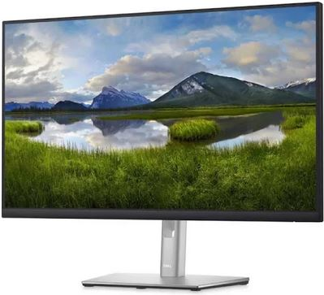 | R$ 1399,00 |
| **Moldura de Madeira** | - Estrutura de suporte e fixação para o conjunto<br>- Adaptada às dimensões do monitor e vidro |  | R$ 50,00 |
| **Vidro para Espelho Inteligente** | - Dimensão ajustada para cobrir a tela do monitor<br>- Espessura específica para garantir resistência e efeito de espelho | 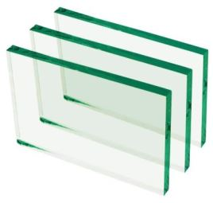 | R$ 25,00 |
| **Película Reflectiva (50x100 cm)** | - Cria o efeito espelhado quando a tela não está ligada<br>- Essencial para transformar o monitor em um espelho interativo |  | R$ 16,91 |
| **Sensor de Gestos GY-PAJ7620U2** | - Detecta movimentos das mãos para controle sem toque<br>- Escolhido após testes com outros sensores | 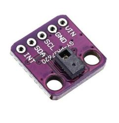 | R$ 27,00 |
| **JBL (Caixa de Som)** | - Utilizada para saída de áudio dos módulos interativos<br>- Aumenta a interatividade e imersão do usuário | 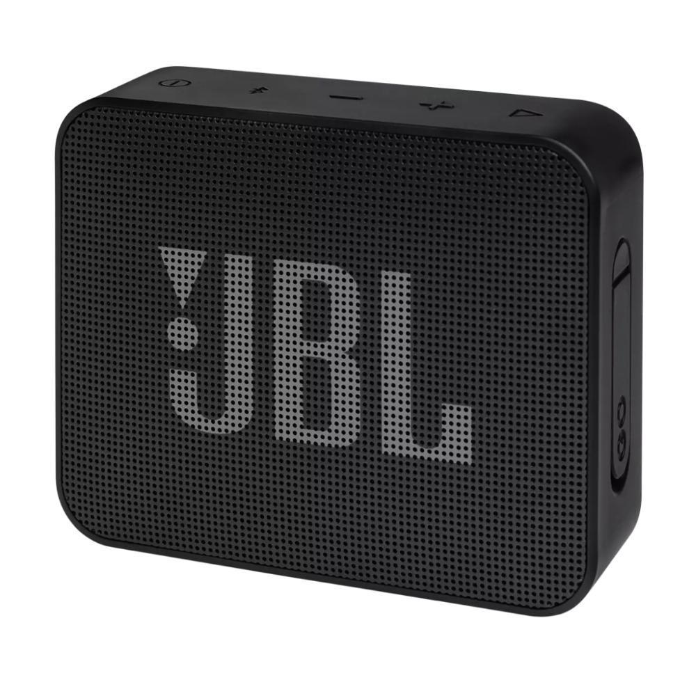 | R$ 165,00 |

### Componentes de Hardware Considerados (Não Utilizados)

| Componente | Descrição | Imagem | Motivo de Descarte | Custo Aproximado |
|------------|-----------|--------|--------------------|------------------|
| **Moldura Touch Screen** | - Facilitaria a interação direta com o espelho através de toques<br>- Permite um controle intuitivo do sistema |  | Alto custo e complexidade na instalação e integração com o sistema | R$ 500,00 |
| **Sensor PIR** | - Utilizado para detectar presença humana e ajustar o brilho da tela ou ligar/desligar automaticamente<br>- Poderia aumentar a economia de energia<<br> - Poderíamos tirar a função de detecção do sensor de gestos | 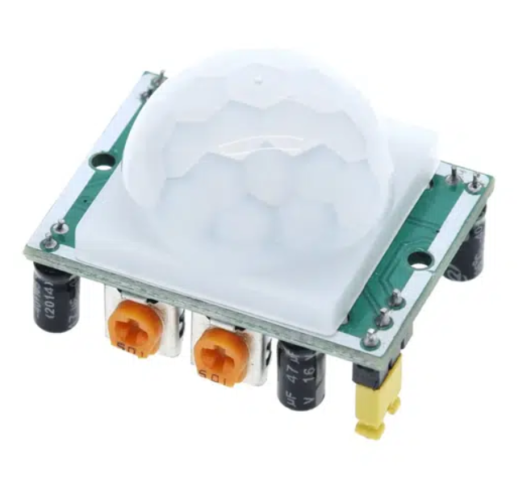 | Tempo de implementação | R$ 30,00 |
| **LEDs para Iluminação** | - LEDs integrados ao redor da moldura para iluminação adicional<br>- Poderia fornecer luz ambiente ou notificações visuais | 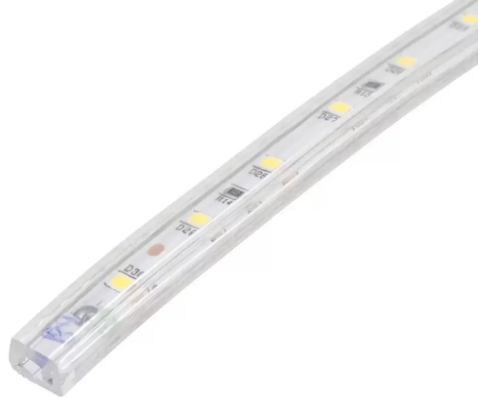 | Custo de instalação e necessidade de integração com o sistema | R$ 30,00 |
| **Acrílico Especial para Reflexão** | - Acrílico com transparência e reflexividade específicas para melhor efeito de espelho<br>- Alternativa ao vidro comum para maior leveza, resistência e visibilidade. | 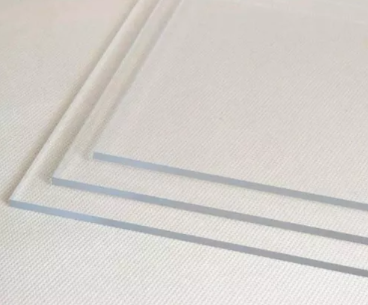 | Difícil de encontrar no mercado local e custo elevado | R$ 350,00 |
| **Raspberry Pi Camera Module** | - Câmera integrada para reconhecimento facial ou videoconferência<br>- Poderia ser usada para segurança ou interação avançada e interação com perfil e detecção do cliente. | 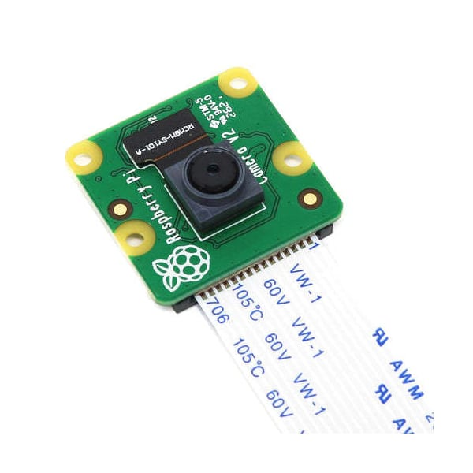 | Complexidade na implementação e preço elevado | R$ 250,00 |
| **Sensor de Temperatura e Umidade DHT** | - Permite medir e exibir a temperatura e umidade interna<br>- Integração com módulos de clima para uma experiência personalizada | 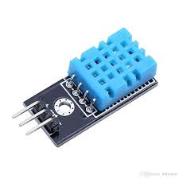 | Tempo necessário para integração | R$ 20,00 |

### Ferramentas Utilizadas

| Ferramenta | Descrição |
|------------|-----------|
| **Chave de Fenda e Martelo** | Utilizadas para montagem e fixação da moldura de madeira |
| **Cola de Madeira e Fita Isolante** | Para acabamento e segurança das conexões |
| **Serra Manual/Elétrica** | Necessária para cortar a madeira nas dimensões corretas |
| **Papel de Acabamento e Lixa** | Para dar acabamento estético e suavizar a madeira |
| **Pregos e Parafusos** | Para fixação da estrutura e montagem final |

## 4. Montagem do Hardware

Construção da Moldura: ~~Descreva o processo de construção da moldura de madeira, incluindo medições e montagem~~.

### Moldura lado frente
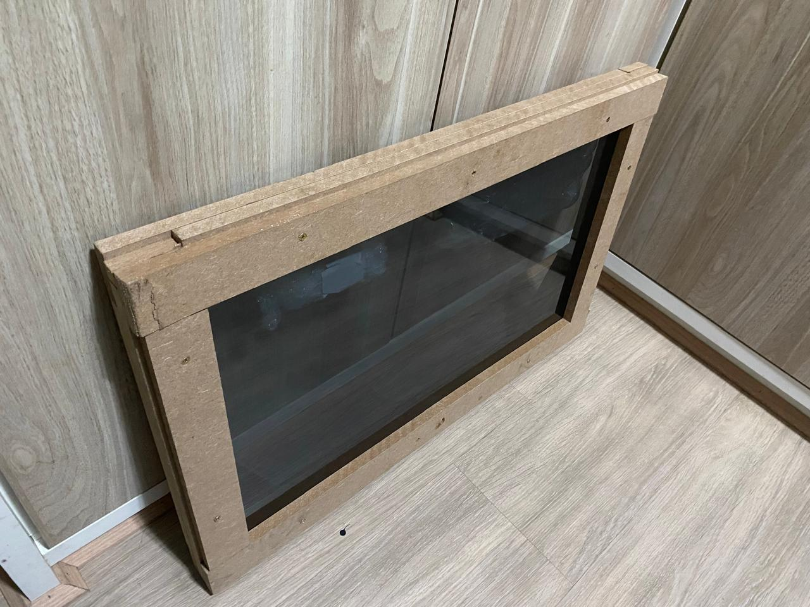

### Moldura lado traseira
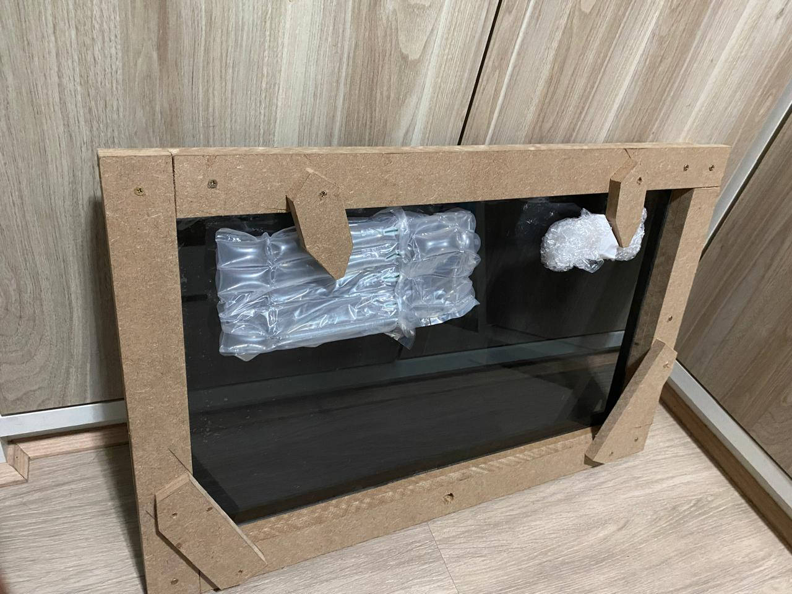

Instalação do Monitor e Vidro: ~~Detalhe como o monitor e o vidro com película reflexiva foram instalados na moldura.~~

### Vidro Película 1


### Vidro Película 2


Instalação do Sensor de Movimento: ~~Explique onde e como o sensor de movimento foi instalado para detectar gestos.~~

### Sensor de gestos


Conexões e Configurações Finais: ~~Descreva como o hardware foi conectado e montado, incluindo a ligação ao Raspberry Pi.~~

### Montagem final


## 5. Configuração do Software

### Instalação do Sistema Operacional
Para começar, precisamos instalar o sistema operacional no Raspberry Pi. Neste projeto, vamos utilizar o Raspberry Pi OS, uma versão otimizada de Linux. O processo é simples:

**1.** Baixar a última versão do Raspberry Pi OS do site oficial.<br>
**2.** Usar um o próprio software do Raspberry Pi para gravar a imagem do sistema operacional em um cartão microSD.<br>
**3.** Inserir o cartão microSD no Raspberry Pi e conectar o dispositivo ao monitor, teclado e mouse.<br>
**4.** Ligar o Raspberry Pi e seguir as instruções na tela para configurar o sistema operacional, incluindo a conexão à internet.<br>

### Configuração da Aplicação
Após o sistema operacional estar pronto, vamos instalar a base do projeto:

**1.** Certificar de que o Node.js está instalado. Para isso, abrir o terminal no Raspberry Pi e instalar a versão mais recente do Node.js conforme as instruções da documentação oficial.<br>
**2.** Verificar se o Git está instalado digitando git no terminal. Se não estiver, instalar com o comando **sudo apt-get install git**.<br>
**3.** Clonar o repositório do projeto base com o comando:

 ```sh
git clone https://github.com/MichMich/MagicMirror
 ```

**4.** Entrar na pasta do projeto:

 ```sh
cd MagicMirror/
 ```

**5.** Instalar o aplicativo com:

 ```sh
npm install
 ```

**6.** Iniciar o aplicativo com o comando **npm start**.


### Instalação dos Módulos
Com a aplicação funcionando, é hora de personalizar conforme a preferencia.

### Módulos usados:

**Hora, Calendário, Agenda, Tempo, Fórmula 1, Rádio, Notícias, Câmeras de Segurança, Informações do Hardware, Sinal Wi-Fi, Spotify, Youtube, Horário de Onibus e Modulos de Sensores**<br>

A instalação e configuração dos módulos foi uma etapa que exigiu bastante pesquisa e trabalho. Cada módulo tem suas especificidades e desafios, API's e configurações, então foi necessário um mergulho nas documentações para entender como cada um deles funciona e como poderiam ser integrados ao projeto. Em alguns casos, foi preciso ajustar configurações detalhadamente, testar diferentes abordagens e, por vezes, até modificar grande parte dos códigos para alcançar o resultado desejado. Essa parte do processo envolveu bastante tentativas e erros, e um bom tempo dedicado a explorar soluções e encontrar a melhor forma de fazer cada módulo interagir de maneira fluida e eficiente com o sistema. Todo esse esforço foi importante para garantir que oprojeto possa oferecer uma experiência realmente personalizada e integrada, mostrando informações úteis de forma dinâmica e adaptada ao contexto do usuário.<br>

Alguns esforços específicos valem a pena ser mencionados, como é o caso da integração dos sensores de movimento ao projeto, no qual foi um desafio significativo e exigiu um trabalho considerável para alcançar o resultado desejado. O objetivo era utilizar os sensores para permitir a interação com o espelho, como mudar de página ou ativar funcionalidades com movimentos das mãos.

Essa integração envolveu diversas etapas complexas:

### Escolha do Sensor
Inicialmente, foi necessário selecionar o sensor adequado para capturar movimentos de forma precisa. Diversos modelos foram avaliados para encontrar aquele que melhor atendia às necessidades do projeto.

Testamos alguns sensores diferentes antes de finalmente encontrar aquele que melhor atendia às nossas necessidades:

**• APDS-9960:** Este sensor foi uma das primeiras opções testadas. Embora oferecesse boas funcionalidades, como detecção de proximidade e gestos, enfrentamos problemas com a precisão e a distância de detecção. O sensor frequentemente falhava em identificar corretamente os movimentos das mãos na distância desejada, o que comprometia a confiabilidade necessária para a aplicação.

<adicionar foto>

**• GP2Y0A21:** O próximo sensor testado foi o GP2Y0A21, conhecido por sua capacidade de medir distâncias. No entanto, este sensor também teve suas limitações. A principal dificuldade foi com as bibliotecas e a integração com o software, que não suportavam bem o sensor, resultando em desempenho insatisfatório e falta de precisão na detecção.

<adicionar foto>

**• PAJ7620U2:** Finalmente, encontramos o sensor PAJ7620U2, que se mostrou muito mais adequado para nossa aplicação. Esse sensor conseguiu atender aos requisitos de detecção de movimento com maior precisão e confiabilidade, permitindo uma interação fluida com o o projeto. Sua integração foi mais eficiente, e o desempenho foi consistente com o que precisávamos para uma experiência de usuário satisfatória.

<adicionar foto>

Durante essa jornada para encontrar o sensor ideal envolveu uma série de testes e ajustes, mas foi essencial para alcançar a funcionalidade desejada e garantir que o projeto respondesse de maneira precisa e confiável aos movimentos das mãos nas quais queriamos inicialmente.

### Configuração do Hardware
A instalação física e a conexão com o Raspberry Pi também exigiram um esforço considerável.

**Instalação Física e Conexão:** A instalação do sensor e sua conexão com o Raspberry Pi envolveu vários ajustes finos. Cada componente teve que ser cuidadosamente posicionado e conectado aos pinos GPIO do Raspberry Pi. Esse processo exigiu atenção aos detalhes para garantir que todas as conexões estivessem firmes e corretamente configuradas, evitando problemas de comunicação e funcionamento incorreto.

**Ajustes nas Bibliotecas:** Após a instalação física, enfrentamos desafios com as bibliotecas necessárias para operar o sensor. As bibliotecas utilizadas inicialmente não estavam totalmente alinhadas com os requisitos do sensor, o que resultou em comportamento instável e dificuldades na detecção. Foram necessários ajustes e atualizações nas bibliotecas para melhorar a compatibilidade e a performance.

**Consultas e Testes:** Para resolver os problemas encontrados, realizamos diversas consultas em fóruns especializados e documentações técnicas. A interação com a comunidade e a busca por soluções em discussões online foram essenciais para entender as nuances do sensor e encontrar as melhores práticas para sua configuração. Cada solução encontrada foi testada rigorosamente para garantir que o sistema funcionasse de acordo com as expectativas.

Esse processo de configuração foi desafiador e exigiu persistência, mas foi crucial para alcançar a integração bem-sucedida do sensor com o projetp. O esforço envolvido garantiu que o sensor de movimento funcionasse de maneira confiável e que o sistema oferecesse a interação intuitiva desejada.

### Desenvolvimento do Software
O maior desafio foi fazer com que o sensor interagisse de forma eficiente com todos os módulos presentes. Isso envolveu a criação de scripts personalizados para processar os sinais do sensor e traduzi-los em ações específicas, como mudar a página exibida. Muitos testes e ajustes foram necessários para obter a sensibilidade adequada e assegurar que o sistema respondesse de maneira precisa e confiável aos movimentos.

### Integração e Testes
A integração do sensor com os módulos e a adaptação da aplicação para reconhecer e responder aos movimentos das mãos foram tarefas complexas. Diversas abordagens foram testadas, e muitas horas foram dedicadas a depurar e ajustar o comportamento do sistema para garantir uma experiência fluida e intuitiva. Processo de muita tentativa, erro e ajustes.

## 6. Funcionalidades Implementadas

O Prototipo a ser apresentado foi organizado de forma a apresentar 3 telas com exemplos de aplicação para o usuário.

 1. Tela 1:  Nesta tela apresentamos um exemplo de integração entre os módulos de cumprimentos, calendário e previsão do tempo. Demonstrando interface proporcione acesso rápido a informações do dia a dia do usuário ao se preparar para sair.

### Tela 1
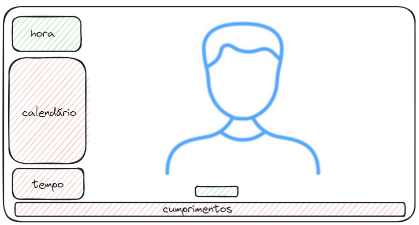

### Tela 1 - implementação
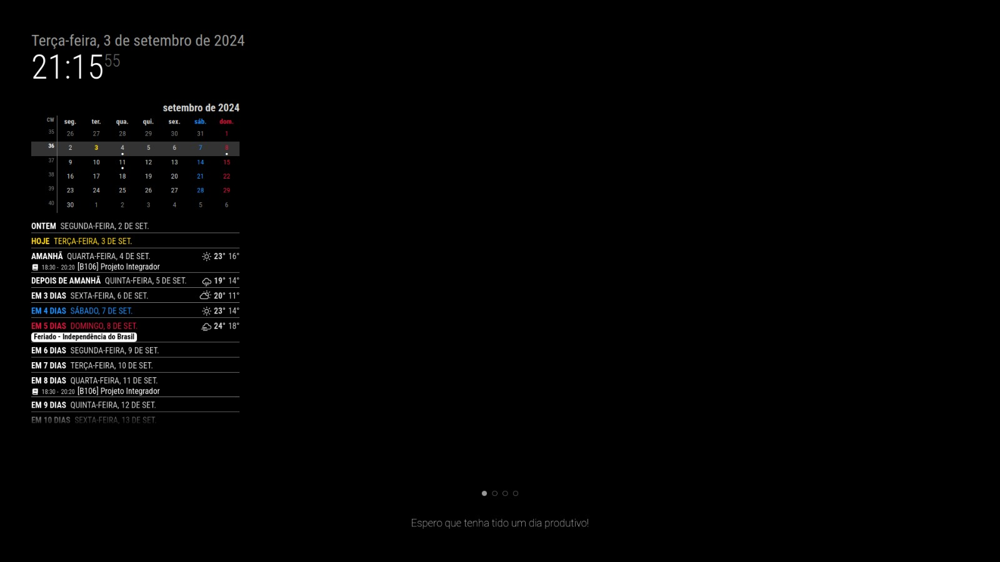

 2. Tela 2:  Nesta tela apresentamos um exemplo de integração entre os módulos de formula 1, rádio e noticias. Demonstrando uma aplicação mais  voltada a entretenimento.

### Tela 2
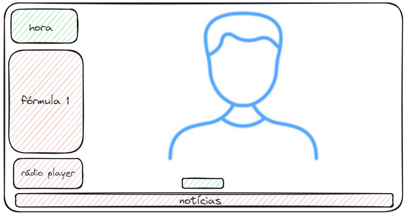

### Tela 2 - implementação
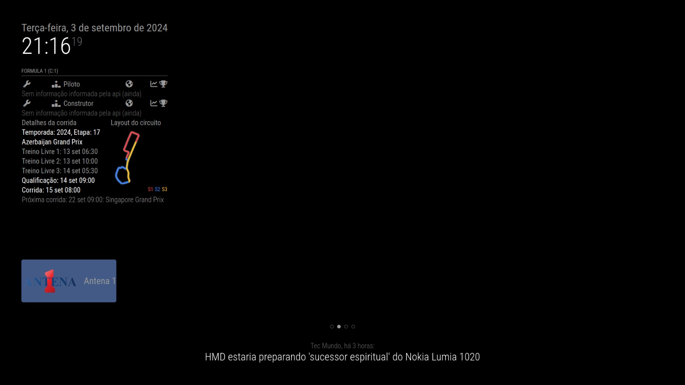

 3. Tela 3:  Nesta tela apresentamos um exemplo de integração entre os módulos de câmeras de segurança e informações do sistema. Demonstrando uma possibilidade de integração voltada a informações mais especificas/avançadas.

### Tela 3
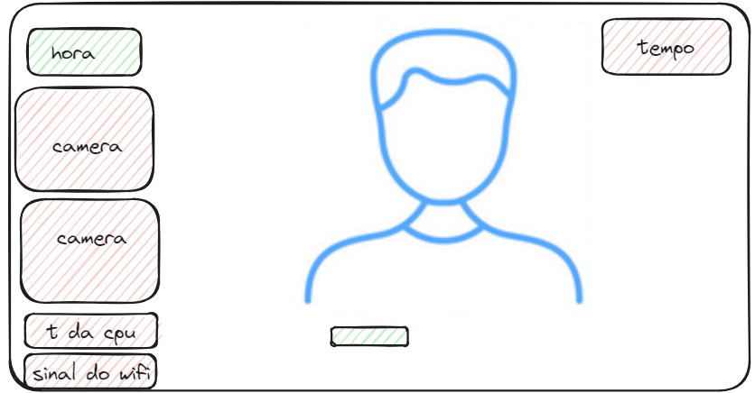

### Tela 3 - implementação
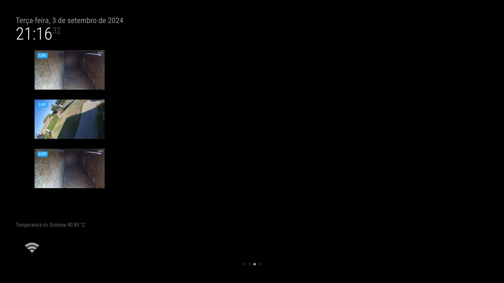

## 7. Desafios e Aprendizados

~~Dificuldades Encontradas:~~

## 8. Próximos Passos e Melhorias Futuras

Em futuras implementações, identificamos diversas oportunidades de aprimoramento e expansão das funcionalidades do Smart Mirror. Algumas sugestões incluem:
 - Execução de playslists (Tela 4 - canto superior esquedo);
 - execução de videos do Youtube (Tela 4 - canto inferior esquedo);
 - Integração com horáios de onibus (Tela 4 - canto superior direito);

### Tela 4 - implementação de outros prototipos
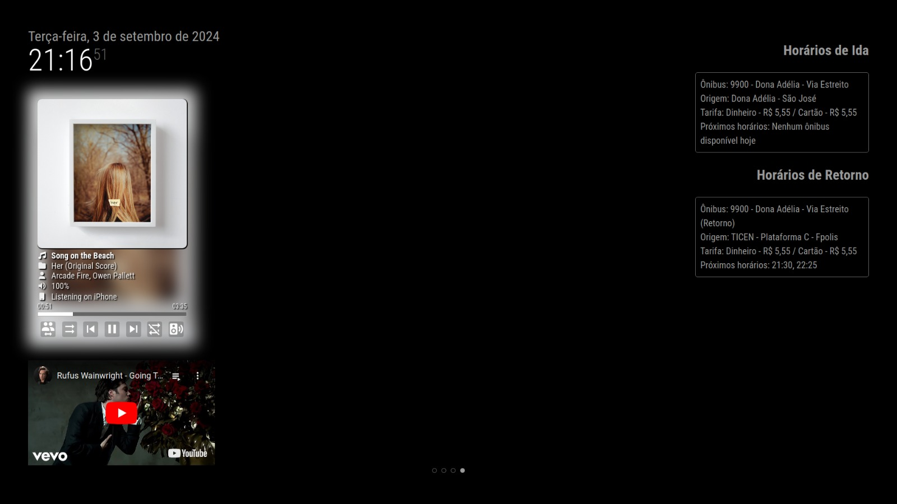

Além disso, seria interessante explorar a possibilidade de utilizar telas mais simples, visando reduzir o custo total do projeto. Outra sugestão seria a revisitar a possibilidade de uso de uma modura com interação touch screen, o que adicionaria uma maior versatilidade permitindo a implementação de módulos que requerem interações mais complexas com o usuário, como a entrada de dados.

## 9. Conclusão

~~Dificuldades Encontradas:~~

## 10. Referências

~~Dificuldades Encontradas:~~
