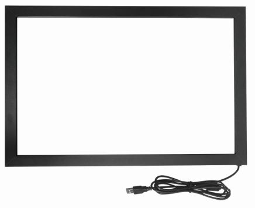

<table align="center"><tr><td align="center" width="9999"><br>


# Unidade Curricular:  Projeto Integrador 3 

<b>Instituto Federal de Educação, Ciência e Tecnologia de Santa Catarina<br>
Campus Florianópolis<br></b>
**Professor:**  Robinson Pizzio e Matheus Leitzke Pinto<br>
**Alunos:**  Alexsander Vieira e Jonathan Chrysostomo Cabral Bonette<br>
</td></tr></table>

* [1. Introdução](#1-introdução)
* [2. Requisitos](#2-requisitos)
* [3. Lista de Componentes](#3-lista-de-componentes)
* [4. Montagem do Hardware](#4-montagem-do-hardware)
* [5. Configuração do Software](#5-configuração-do-software)
* [6. Funcionalidades Implementadas](#6-funcionalidades-implementadas)
* [7. Desafios e Aprendizados](#7-desafios-e-aprendizados)
* [8. Próximos Passos e Melhorias Futuras](#8-próximos-passos-e-melhorias-futuras)
* [9. Conclusão](#9-conclusão)
* [10. Referências](#10-referências)


## 1. Introdução

O projeto do Smart Mirror visa desenvolver um espelho inteligente capaz de exibir informações úteis diretamente na superfície refletora enquanto o usuário realiza suas atividades diárias. A inovação deste dispositivo está na integração de tecnologia avançada com um objeto comum, transformando o espelho em uma interface interativa que proporciona acesso rápido a uma variedade de serviços e informações.

O principal objetivo do Smart Mirror é fornecer informações relevantes de forma prática e imediata, integrando-as ao momento em que o usuário se prepara para o dia. Com uma interface intuitiva, o espelho pode exibir dados como a previsão do tempo, notícias, agenda do dia, notificações de redes sociais, status de dispositivos inteligentes na casa, entre outros.

## 2. Requisitos

**Requisitos Funcionais:** O que o Smart Mirror deve ser capaz de fazer interagir com o usuário de forma a permitir a transição entre a operação como um espelho comum(apenas refletir o usuário) e como um dispositivo smart (apresentar funcionalidades de conectividade). O 
Exemplos de aplica
~~Requisitos Não Funcionais: Inclua aspectos como desempenho, confiabilidade, usabilidade, e segurança.~~
**Requisitos de Software e Hardware:** O sistema devera ser implementado utilizando como hardware um Raspberry Pi 4 Model B com Raspberry Pi OS, onde será desenvolvido a aplicação do smart mirror e a integração de módulos que tragam funcionalidades úteis ao dia a dia do usuário.

## 3. Lista de Componentes

*   Raspberry Pi 4 Model B 
	 * Conectividade Wi-Fi Integrada
	 * Saída de vídeo HDMI integrada
	 * Capacidades de Comunicação IO - leitura de sensores
     * Rapberry OS
     * Custo aproximado: R$250
     
     ### Raspberry Pi 4 Model B


 *   Monitor Dell de 27" - P2722H
	 * Resolução: 1920 x 1080 a 60 Hz
	 * Entrada de vídeo HDMI integrada
	 * Escolhido devido a disponibilidade, ja possuiamos o monitor. Para um produto final este precisaria ser revisado para reduzir o custo de projeto.
     * Custo aproximado: R$xxxxxxx
     
     ### Monitor Dell de 27" - P2722H
   

 *   Moldura de Madeira
	 * Fixar e dar estrutura ao conjunto.
   * Dimensão
     * Custo aproximado: R$xxxxxxx
     
     ### Moldura de madeira


 *   Vidro
	 * Dimensão 
	 * Espessura
     * Custo aproximado: R$xxxxxxx
     
     ### Vidro


 *   Película Reflectiva, Proteção de Privacidade, Vidro Adesivos, 50x100cm
	 * Criar efeito espelhado quando a tela não estiver ligada.s
     * Custo aproximado: R$ 16,91
     
     ### Película espelhada


 *   Sensor de gestos
	 * Modelo: GY-PAJ2620
	 * Capacidade de interagir com sistema utiizando gestos padronizados
     * Custo aproximado: R$ 27,82
     
     ### Sensor de gestos


 *   ~~Moldura touch screem~~
	 * ~~Facilidade de interagir com sistema~~
     * ~~Custo aproximado:~~ R$ 500,00, descartado neste momento devido ao custo ele
     
     ### ~~Moldura touch screem~~


## 4. Montagem do Hardware

Construção da Moldura: ~~Descreva o processo de construção da moldura de madeira, incluindo medições e montagem~~.

### Moldura lado frente


### Moldura lado traseira


Instalação do Monitor e Vidro: ~~Detalhe como o monitor e o vidro com película reflexiva foram instalados na moldura.~~

### Vidro Película 1


### Vidro Película 2


Instalação do Sensor de Movimento: ~~Explique onde e como o sensor de movimento foi instalado para detectar gestos.~~

### Sensor de gestos


Conexões e Configurações Finais: ~~Descreva como o hardware foi conectado e montado, incluindo a ligação ao Raspberry Pi.~~

### Montagem final


## 5. Configuração do Software

Instalação do Sistema Operacional: ~~Explicação passo a passo da instalação do sistema operacional no Raspberry Pi.~~

Configuração do Smart Mirror: ~~Detalhe como o software  foi instalado e configurado.~~

Instalação e customização dos Módulos:

Modulo agenda.  
Etapas:

1. 1
2. 2

 ```C

 ```

Modulo calendário.  
Etapas:

1. 1
2. 2

 ```C

 ```
 
Modulo previsão de tempo.  
Etapas:

1. 1
2. 2

 ```C

 ```

Modulo Cumprimentos/frase motivacionais.  
Etapas:

1. 1
2. 2

 ```C

 ```

Modulo Formula 1.  
Etapas:

1. 1
2. 2

 ```C

 ```

Modulo Rádio.
Etapas:

1. 1
2. 2

 ```C

 ```
 
Modulo Feed de noticias.
Etapas:

1. 1
2. 2

 ```C

 ```

Modulo Câmeras segurança.  
Etapas:

1. 1
2. 2

 ```C

 ```
 
Modulo Informações de sistema.  
Etapas:

1. 1
2. 2

 ```C

 ```
 
Modulo Horários de ônibus.  
Etapas:

1. 1
2. 2

 ```C

 ```
Modulo Spotify.  
Etapas:

1. 1
2. 2

 ```C

 ```
## 6. Funcionalidades Implementadas

O Prototipo a ser apresentado foi organizado de forma a apresentar 3 telas com exemplos de aplicação para o usuário.

 1. Tela 1:  Nesta tela apresentamos um exemplo de integração entre os módulos de cumprimentos, calendário e previsão do tempo. Demonstrando interface proporcione acesso rápido a informações do dia a dia do usuário ao se preparar para sair.

### Tela 1


 2. Tela 2:  Nesta tela apresentamos um exemplo de integração entre os módulos de formula 1, rádio e noticias. Demonstrando uma aplicação mais  voltada a entretenimento.

### Tela 2


 3. Tela 3:  Nesta tela apresentamos um exemplo de integração entre os módulos de câmeras de segurança e informações do sistema. Demonstrando uma possibilidade de integração voltada a informações mais especificas/avançadas.

### Tela 3


## 7. Desafios e Aprendizados

~~Dificuldades Encontradas:~~

## 8. Próximos Passos e Melhorias Futuras

~~Dificuldades Encontradas:~~

## 9. Conclusão

~~Dificuldades Encontradas:~~

## 10. Referências

~~Dificuldades Encontradas:~~
