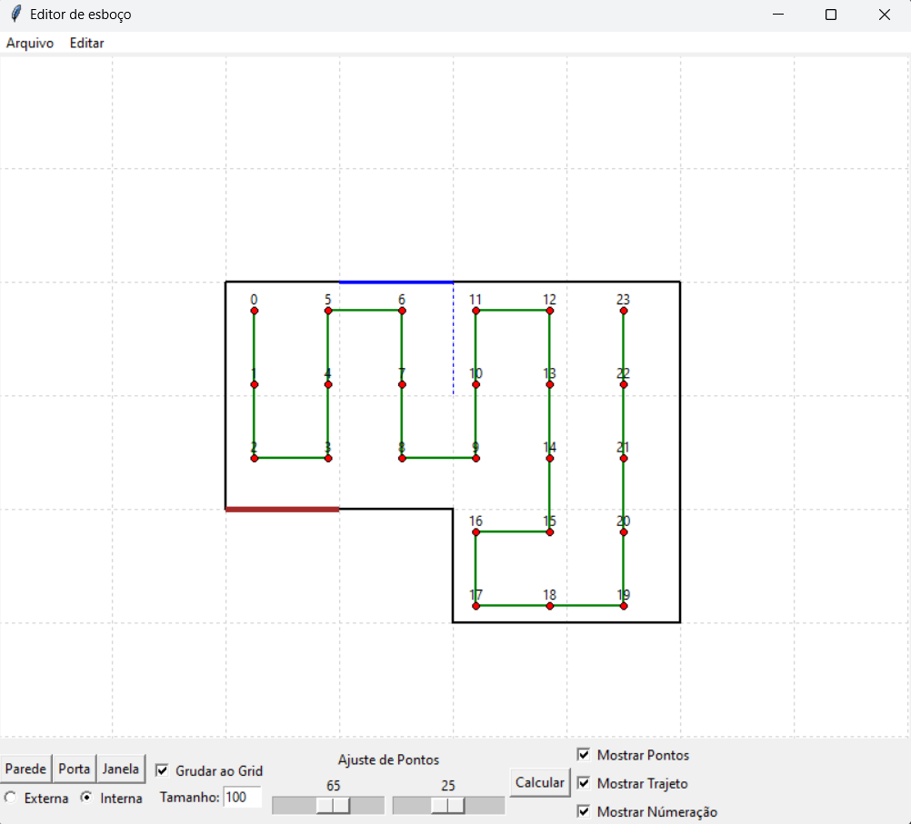
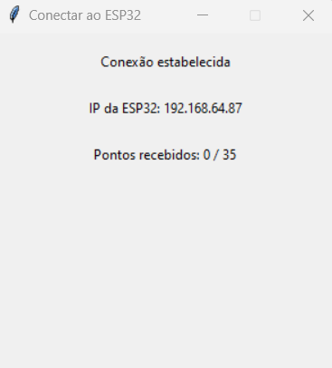
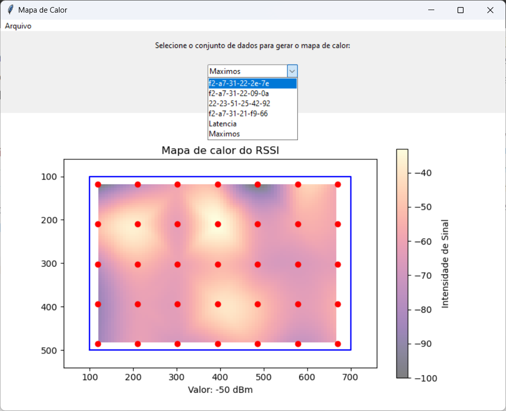

**INSTITUTO FEDERAL DE SANTA CATARINA**

**Unidade Curricular:**  Projeto Integrador 3 

**Professor:**  Robinson Pizzio e Matheus Leitzke Pinto 

**Alunos:**  Natália Besen e Victor Lompa Schwider


#  Analisador de Sinal de Wi-fi

* [Introdução](#introdução)
* [Componentes utilizados](#componentes-utilizados)
* [Testes de validação inicial](#testes-de-validação-inicial)
* [Implementação](#implementação)
* [Modo de uso](#modo-de-uso)
* [Testes finais](#testes-finais)
* [Conclusão](#conclusão)

## Introdução

O projeto do Analisador de Sinal de Wi-Fi visa desenvolver um dispositivo destinado a medir e mapear a intensidade do sinal Wi-Fi em um ambiente específico. A importância dessa ferramenta está na sua capacidade de identificar áreas com sinal fraco ou "pontos cegos" em uma rede sem fio, proporcionando informações valiosas para a otimização da conectividade.

Um dos principais objetivos deste projeto é realizar medições ponto a ponto do sinal Wi-Fi em diferentes locais do ambiente. Para isso, o usuário precisa percorrer o ambiente enquanto o dispositivo realiza as medições em tempo real.

Os dados obtidos serão representados em forma de mapa de calor. Esse mapa de calor oferece uma visualização intuitiva da distribuição do sinal Wi-Fi, destacando as áreas com sinal forte em cores quentes e as áreas com sinal fraco em cores frias. Essa visualização facilita a identificação rápida de áreas problemáticas e orienta a tomada de decisões para melhorar a cobertura da rede.

A identificação de "pontos cegos", ou seja, áreas onde o sinal Wi-Fi é insuficiente ou inexistente, é outra funcionalidade essencial do Analisador de Sinal de Wi-Fi. Essa capacidade permite que os usuários identifiquem áreas críticas que necessitam de intervenção para melhorar a conectividade, seja por meio de reposicionamento de dispositivos ou adoção de soluções de ampliação do alcance do sinal.

Além disso, o projeto visa atender às necessidades específicas das redes de roteadores mesh, amplamente utilizadas em residências e escritórios. Essas redes, compostas por vários dispositivos interconectados, demandam uma cobertura uniforme para garantir uma conexão estável em toda a residência. O Analisador de Sinal de Wi-Fi surge como uma resposta a essa demanda, oferecendo uma ferramenta poderosa para otimizar a localização desses dispositivos e garantir uma experiência de conectividade sem fio de alta qualidade.


## Componentes utilizados

 *   ESP32 Dev-Kit  
	 *  Conectividade Wi-Fi Integrada
	 * Potência de Processamento
	 * Capacidades de Comunicação
     * Compatibilidade com Bibliotecas
     
     

* LEDs e Push Button
	* Os LEDs foram utilizados para sinalização do status da aplicação
	* O Push Button deve ser pressionado para que a medição seja realizada
     
## Testes de validação inicial

### Medição da intensidade do sinal de Wi-Fi

Inicialmente foi implementado um código para realizar a medição do **RSSI** (Received Signal Strength Indication) de uma rede Wi-Fi especificada. O **RSSI** é uma medida da potência do sinal recebido por um dispositivo em uma rede Wi-Fi. Este parâmetro é tipicamente medido em decibéis relativos a um miliwatt (dBm) e é geralmente representado como um valor negativo. Quanto mais próximo de zero, mais forte é o sinal.
Por meio da função `wifi_scan` exibida a seguir é possível obter a informação de RSSI da rede Wi-Fi desejada.  
A função `wifi_scan` realiza as seguintes etapas:

1.  Configura a varredura Wi-Fi.
2.  Inicia a varredura e espera até que seja concluída.
3.  Obtém o número de APs encontrados.
4.  Se nenhum AP for encontrado, a função retorna.
5.  Obtém os registros dos APs encontrados.
6.  Prepara os dados formatados para cada AP encontrado e os armazena em um buffer.
7.  Registra no log que os dados foram preparados para envio.

 ``` C
 static  void  wifi_scan(void)
{
	wifi_scan_config_t  scan_config  =  {
		.ssid =  (uint8_t  *)target_SSID,
		.bssid =  0,
		.channel =  0,
		.show_hidden =  true,
		.scan_type =  WIFI_SCAN_TYPE_ACTIVE,
		.scan_time.active =  {
			.min =  100,
			.max =  1000
		}
	};

	ESP_ERROR_CHECK(esp_wifi_scan_start(&scan_config,  true));
	uint16_t  ap_count  =  0;
	ESP_ERROR_CHECK(esp_wifi_scan_get_ap_num(&ap_count));
	ESP_LOGI(__func__,  "Total APs scanned = %" PRIu16, ap_count);
  
	if  (ap_count  ==  0)  {
		return;
	}
  
	wifi_ap_record_t  ap_info[ap_count];
	ESP_ERROR_CHECK(esp_wifi_scan_get_ap_records(&ap_count,  ap_info));
	strcpy(post_data,  "");  // Inicializa o buffer de  dados

	for  (int  i  =  0;  i  <  ap_count;  i++)  {
		char  ap_data[128];
		snprintf(ap_data,  sizeof(ap_data),  "SSID: %s, RSSI: %d\n",  ap_info[i].ssid,  ap_info[i].rssi);
		strcat(post_data,  ap_data);
	}

	ESP_LOGI(__func__,  "Dados  da  varredura Wi-Fi preparados  para  envio.");

}
 ```


### Medição de Latência

A medição de latência também é importante para avaliar a qualidade do sinal Wi-Fi. **Latência** é o tempo que um pacote de dados leva para viajar de um ponto de origem a um ponto de destino e vice-versa. Dessa forma, foi implementado uma função que mede a latência da rede Wi-Fi enviando pings para o servidor DNS do Google (`8.8.8.8`). Ela utiliza callbacks para registrar o tempo de resposta de cada ping, calcula a latência média após a conclusão de todos os pings e prepara os dados para envio.
As função `ping_success_callback` e  `check_latency`demonstradas a seguir foram criadas para realizar a medição da latência.
A função `check_latency` realiza as seguintes etapas:

1. Inicialização dos dados.
2. Configuração do Endereço de Destino.
3. Configuração dos Callbacks.
4. Início da Sessão de Ping.
5. Aguarda Conclusão dos Pings.
6. Finaliza a Sessão de Ping
7. Cálculo da Latência Média
8. Log e Preparação dos Dados
   

 ```C
 /* Função para medir a latência usando ping */
static void check_latency(void)
{
    uint32_t medLatency = 0;
    esp_ping_config_t config = ESP_PING_DEFAULT_CONFIG();
    config.count = pings;

    ip_addr_t target_addr;
    inet_pton(AF_INET, "8.8.8.8", &target_addr.u_addr.ip4);
    target_addr.type = IPADDR_TYPE_V4;
    config.target_addr = target_addr;

    esp_ping_callbacks_t cbs;
    memset(&cbs, 0, sizeof(cbs));
    cbs.on_ping_success = ping_success_callback;
    cbs.on_ping_end = NULL;  // Evita cálculo duplicado na função de finalização

    esp_ping_handle_t ping;
    ESP_ERROR_CHECK(esp_ping_new_session(&config, &cbs, &ping));
    esp_ping_start(ping);

    // Espera até que o ping termine antes de continuar
    vTaskDelay(pdMS_TO_TICKS(pings * 1000));  // Espera até que o número de pings termine (aproximadamente 1 segundo por ping)

    esp_ping_stop(ping);
    esp_ping_delete_session(ping);

    ping_count = 0;
    for(int i = 0; i < pings; i++) medLatency += latency[i];
    medLatency = medLatency / pings;

    ESP_LOGI(__func__, "Latency: %" PRIu32 " ms", medLatency);

    strcpy(post_data, "");  // Inicializa o buffer de dados
    char ap_data[32];
    snprintf(ap_data, sizeof(ap_data), "Latency: %" PRIu32 " ms", medLatency);
    strcat(post_data, ap_data);
}

 ```

Enquanto a função `ping_success_callback` obtém o tempo decorrido (latência) do ping bem-sucedido e armazena o valor em array.
 ```C
 static  void  ping_success_callback(esp_ping_handle_t  hdl,  void  *args)

{
	uint32_t  elapsed_time;
	esp_ping_get_profile(hdl,  ESP_PING_PROF_TIMEGAP,  &elapsed_time,  sizeof(elapsed_time));
	ESP_LOGI("check_latency",  "Ping: %" PRIu32 " ms", elapsed_time);

	if(ping_count < pings){

		latency[ping_count]  =  elapsed_time;
		ping_count ++;

	}

}
 ```

### Criação de um servidor http

Para a coleta e o armazenamento de dados medidos pelo ESP32, foi implementado um servidor web simples utilizando Python e o framework Flask. Este servidor HTTP é capaz de receber dados enviados pelo ESP32 através de solicitações POST, processá-los e retornar uma confirmação de recebimento. Por meio do servidor é possível realizar o armazenamento e posterior análise dos dados recebidos.
O código do servidor será exibido a seguir:
```python
from flask import Flask, request, jsonify

app = Flask(__name__)

@app.route('/data', methods=['POST'])
def receive_data():
    if request.is_json:
        data = request.get_json()
    else:
        data = request.form.to_dict()
    print(f"Received data: {data}")
    # Aqui você pode salvar os dados em um banco de dados ou arquivo
    return jsonify({"status": "success"}), 200

if __name__ == '__main__':
    app.run(host='0.0.0.0', port=5000)

```

### Envio dos dados via http

Para o envio dos dados obtidos de RSSI e latência medidos foi implementada a função `http_send_data`, conforme mostrado abaixo.
A função `http_send_data` realiza os seguintes passos:
1.  Configura o cliente HTTP com a URL do servidor e o método POST.
2.  Inicializa o cliente HTTP com a configuração especificada.
3.  Define os dados que serão enviados no corpo da requisição POST.
4.  Executa a requisição HTTP e verifica se foi bem-sucedida, logando o resultado.
5.  Limpa os recursos utilizados pelo cliente HTTP.

```C
static  void  http_send_data(void)
{
	esp_http_client_config_t  config  =  {

		.url = SERVER_URL,

		.method =  HTTP_METHOD_POST,

		.event_handler =  NULL,

	};

	esp_http_client_handle_t  client  =  esp_http_client_init(&config);

	esp_http_client_set_post_field(client, post_data,  strlen(post_data));

	esp_err_t  err  =  esp_http_client_perform(client);

	if  (err  ==  ESP_OK)  {

		ESP_LOGI(__func__,  "Dados  enviados  com  sucesso");

	}  
	else  {

		ESP_LOGE(__func__,  "Erro  durante o envio  dos  dados: %s",  esp_err_to_name(err));

	}

	esp_http_client_cleanup(client);

}
```
## Implementação 

A implementação do analisador de Wi-Fi foi desenvolvida com um enfoque em modularidade e organização, garantindo que as diversas funcionalidades sejam distribuídas em módulos específicos. O código em python é dividido principalmente em três partes: `interfaces.py`, responsável pela interface gráfica da aplicação; `server.py`, que lida com a comunicação entre o servidor e o dispositivo ESP32; e `heatmap.py`, que cuida da geração e exibição dos mapas de calor.

Além disso, a implementação no ESP32 desempenha um papel crucial no projeto. O código embarcado no ESP32 realiza a varredura de redes Wi-Fi, coleta os dados de intensidade de sinal (RSSI) e latência, e envia essas informações ao servidor Python para análise posterior. O ESP32 é responsável por executar as medições de acordo com os pontos de referência definidos no esboço da residência, garantindo que os dados coletados reflitam a realidade do ambiente em que o Wi-Fi está sendo avaliado.

### Interface Gráfica

Em `interface.py` o código define a classe `MainApp`, que é responsável por gerenciar a interface principal do aplicativo. Essa interface oferece três funcionalidades principais, acessíveis por meio de botões: `Editar Esboço`, `Conectar ao ESP`, e `Mapa de Calor`. Cada funcionalidade abre uma nova janela específica para a execução de tarefas distintas.


O código completo pode ser visualizado a seguir:  [Interface.py](./Interface.py)

### Criação da planta da residência

Em [Interface.py](./Interface.py) também foi definida a classe `HouseSketch` que é responsável por gerenciar e manipular o esboço da residência onde as medições de sinal Wi-Fi serão realizadas.  Ao  selecionar o botão `Editar Esboço` uma tela distinta é aberta permitindo ao usuário desenhar o layout da residência.

A aplicação calcula automaticamente os pontos de medição com base no esboço criado. As paredes internas, portas e janelas são elementos visuais e não influenciam no cálculo dos pontos de medição; no entanto, as paredes externas são obrigatórias e devem formar um polígono fechado para viabilizar o cálculo. Após desenhar o polígono das paredes externas, o usuário pode pressionar o botão `Calcular` para que os pontos de medição sejam gerados. Estes pontos são as localizações aproximadas em que o usuário deve acionar o dispositivo de medição do sinal Wi-Fi na residência representada pelo esboço.

O usuário pode ajustar a distância entre os pontos de medição e a distância relativa desses pontos em relação às paredes externas utilizando os sliders de `Ajuste de Pontos`. Além disso, é possível personalizar o estilo de visualização dos pontos por meio de três checkboxes localizados à direita da tela.

O esboço pode ser salvo para futuras edições, carregado caso já tenha sido previamente salvo, ou descartado para a criação de um novo. Funções de desfazer e refazer permitem maior controle durante o processo de edição. Por padrão, a opção `Grudar ao Grid` é ativada, facilitando a criação do polígono das paredes externas, que se completa quando o usuário clica novamente no ponto inicial.
Por fim, o usuário pode sair da tela de edição do esboço, e, enquanto o menu principal da aplicação permanecer aberto, os dados do esboço continuarão armazenados, permitindo edições futuras conforme necessário.



### Conexão com ESP32

A classe `Server` definida em `server.py`é fundamental para a funcionalidade de conexão e comunicação entre a aplicação e o dispositivo ESP32. Essa classe gerencia a interface gráfica de conexão com o ESP32, permitindo ao usuário visualizar o status da conexão, o IP do dispositivo e o número de pontos de medição recebidos.

Ao selecionar a opção `Conectar ao ESP` exibida na interface principal, uma janela intitulada "Conectar ao ESP32" é aberta, onde a mensagem "Aguardando mensagem Broadcast do ESP32" é exibida. 

A função `broadcast` é essencial para a comunicação inicial entre a aplicação Python e a ESP32. Ela começa criando um socket UDP configurado para receber mensagens de broadcast e aguardando a mensagem "ESP32_HERE" . Para que a aplicação Python receba a mensagem de broadcast da ESP32, ambos os dispositivos devem estar conectados à mesma rede.  Quando a mensagem esperada é recebida pelo ESP, a função captura o endereço IP da ESP32 e envia uma resposta com o IP da aplicação Python e o número de pontos de medição desejado. A aplicação aguarda uma confirmação da ESP32 para garantir que a mensagem foi recebida corretamente. Se a confirmação não chega dentro do tempo limite, a mensagem é reenviada. 

Após a confirmação ser recebida, o socket é fechado, e um servidor Flask é iniciado na função `run_flask_app` em uma thread separada para receber os dados da ESP32. A interface gráfica é então atualizada para refletir que a conexão foi estabelecida e que a aplicação está pronta para receber os dados. O servidor Flask é executado em uma thread separada para não interferir na interface gráfica, que é controlada pelo Tkinter. Isso permite que a aplicação continue respondendo às interações do usuário enquanto espera pelos dados da ESP32.

O servidor Flask que recebe os dados de medição do ESP32. Esses dados, que incluem informações sobre o SSID, BSSIDs, canais e RSSIs, além de latências medidas em cada ponto, são armazenados em uma estrutura de dados organizada pela classe na função `receive_data`.



Em [server.py](./server.py) pode ser visualizado o código completo implementado.

### Geração do mapa de calor 

O script `heatmap.py` é projetado para criar uma visualização detalhada da intensidade do sinal Wi-Fi e da latência com base nos dados medidos pela ESP32 e recebidos pelo servidor. Ao selecionar o botão `Mapa de Calor` na interface principal, o usuário pode escolher o conjunto de dados a ser analisado. As opções incluem a intensidade de sinal dos Access Points (APs) avaliados pela ESP32 e, na opção `Máximos`, o melhor caso de intensidade RSSI para cada ponto. Caso a análise seja realizada com um roteador único, o melhor caso será idêntico ao único AP. Além disso, é possível gerar um mapa de calor da latência da rede analisada, proporcionando uma visão abrangente da performance da rede. 

O usuário também pode carregar um esboço da área a ser analisada, que serve de referência para a visualização dos dados. O esboço desenhado na aplicação e os pontos definidos são automaticamente exibidos ao fundo do mapa de calor. Além disso também é possível carregar medições externas salvas anteriormente.

A visualização é gerada usando a biblioteca Matplotlib, que cria o mapa de calor com uma escala de cores variando conforme a intensidade do sinal ou a latência. O gráfico é integrado na interface Tkinter através do `FigureCanvasTkAgg` do Matplotlib, permitindo que o gráfico seja exibido diretamente na janela da aplicação. A interatividade é um recurso importante: o usuário pode passar o mouse sobre os pontos no gráfico para visualizar valores específicos, oferecendo uma análise mais detalhada dos dados.

Com essas informações, o usuário pode avaliar melhor a cobertura dos APs instalados e identificar áreas com deficiência de sinal ou interferências, como paredes e outros obstáculos que podem afetar a qualidade do sinal. Isso facilita a criação de estratégias para otimizar o posicionamento dos APs e melhorar a cobertura da rede Wi-Fi na residência.



O código completo para geração do mapa de calor está disponível em: [heatmap.py](./heatmap.py)

### Código embarcado no ESP32

O código desenvolvido para o ESP32  tem como objetivo realizar a medição do sinal de redes Wi-Fi e calcular a latência de uma rede específica, além de enviar esses dados para o servidor Python via requisições HTTP.

O código começa com a inicialização da memória Flash (NVS) e a configuração da conexão Wi-Fi, onde o ESP32 se conecta à rede Wi-Fi definida pelas variáveis `WIFI_SSID` e `WIFI_PASS`. A configuração do Wi-Fi é feita utilizando a API do ESP-IDF, e LEDs conectados ao ESP32 fornecem feedback visual sobre o status da conexão.

Na função `udp_broadcast_task()` o ESP usa a comunicação UDP para enviar uma mensagem de broadcast com seu IP para o servidor. Ele aguarda uma resposta do servidor que contém o IP do servidor Python e o número total de pontos a serem medidos. Após receber e processar a resposta, o ESP32 confirma o recebimento com uma mensagem de confirmação.

O botão no ESP32 é usado para iniciar e controlar a tarefa de medição de Wi-Fi `scan_and_send_task()`. Quando o botão é pressionado, ele aciona um evento que faz com que o ESP32 comece a realizar a varredura das redes Wi-Fi e medir a intensidade e latência do sinal de cada rede detectada e enviar esses dados ao servidor.

Para garantir que a medição e o envio dos dados sejam realizados corretamente, o código implementa uma lógica de controle para o botão. Como o uso de interrupções e fila para detectar quando o botão é pressionado e evitar que o botão seja registrado erroneamente durante o processo de medição. Por exemplo, a variável `is_measuring` é utilizada para garantir que o botão não registre novos eventos enquanto o dispositivo está ocupada realizando medições.

O LED amarelo fica aceso enquanto aguarda que o botão seja pressionado pelo usuário e quando a medição é concluída e os dados enviados o LED verde se acende por alguns segundos. Em caso de erros na conexão do ESP com wi-fi ou na comunicação com o servidor o LED vermelho será aceso.

Utilizando a função de ping do ESP32, o código mede a latência de uma rede específica (neste caso, o servidor DNS do Google, 8.8.8.8) na função `check_latency()`. A medição é realizada repetidamente para calcular uma média da latência.
    
Na função `wifi_scan()` o ESP32 realiza uma varredura ativa das redes Wi-Fi disponíveis, coletando informações como o SSID, BSSID, canal e intensidade do sinal (RSSI) de cada ponto de acesso encontrado. Esses dados são armazenados em um buffer e preparados para o envio.
    
Os dados coletados são enviados ao servidor Python através de uma requisição HTTP POST na função `http_send_data()`. O ESP32 tenta enviar os dados até três vezes em caso de falha, com um intervalo entre as tentativas. Após o envio de todos os pontos, o código finaliza a tarefa de envio e acende um LED verde para indicar a conclusão da medição.
   
   Além disso código implementa verificações e mecanismos para garantir que, em caso de falhas durante a comunicação de rede ou no armazenamento dos dados, o sistema possa lidar com essas situações sem travar ou perder informações críticas. Isso inclui a verificação de sucesso na conexão Wi-Fi, validação do envio de pacotes de dados, e checagem de erros ao gravar informações em memória.

O código completo embarcado no ESP32 pode ser visualizado em [Código ESP32](./main.c)

### PCB desenvolvida

Em termos de hardware, foi desenvolvida uma PCB protótipo para o projeto, que integra diversos componentes essenciais. Esta placa conecta o ESP32 a três LEDs (vermelho, amarelo e verde) para indicar o status do dispositivo, além de um botão que inicia o processo de medição. A alimentação é fornecida por duas baterias de íon-lítio (Li-ion) conectadas em série, garantindo uma operação estável. A PCB também inclui uma placa de gerenciamento de bateria (BMS) para garantir o uso seguro e o carregamento adequado das baterias. Por fim, uma chave liga/desliga foi adicionada para facilitar o controle de energia do dispositivo.


## Modo de uso 

**Modo de Uso:**

1.  **Preparação do Dispositivo:**
    
    -   Certifique-se de que as baterias Li-ion estejam carregadas 
    -   Mantenha o dispositivo desligado enquanto realiza as etapas iniciais na aplicação.
2.  **Configuração na Aplicação:**
    
    -   Inicie a aplicação no computador.
    -   Utilize a ferramenta de desenho para criar o esboço do local onde as medições serão realizadas.
    -   Após finalizar o esboço, clique no botão "Conectar ao ESP" na aplicação para estabelecer a conexão entre o computador e o ESP32.
3.  **Início da Medição:**
    
    -   Após a conexão ser confirmada, ligue o dispositivo utilizando a chave liga/desliga.
    -   O LED amarelo acenderá, indicando que o dispositivo está pronto para iniciar as medições.
    -   Com o dispositivo ligado, percorra o local desenhado na aplicação, posicionando-se nos pontos calculados e pressionando o botão de medição para coletar os dados de intensidade do sinal (RSSI) e latência em cada ponto.
    -   LED amarelo permanecerá aceso, aguardando que o botão seja pressionado e o LED verde indicará quando a medição foi concluída e você poderá seguir para o próximo ponto
4.  **Envio dos Dados:**
    
    -   Ao concluir a medição, os dados coletados serão automaticamente enviados ao servidor Python para análise e geração do mapa de calor.
    -   O LED verde ficará aceso para indicar que o todos os dados foram enviados com sucesso. Em caso de erro, o LED vermelho se acenderá.
5.  **Visualização dos Resultados:**

	-   Após a conclusão das medições e o envio dos dados, utilize o botão "Mapa de Calor" na aplicação para visualizar as medições realizadas sobre o esboço desenhado. O mapa de calor exibirá a intensidade do sinal em cada ponto medido, permitindo uma análise visual da cobertura Wi-Fi no local.

## Testes Finais

Os testes finais foram realizados para assegurar a funcionalidade e a precisão do dispositivo nas medições. Para isso, foi desenhado um esboço real do local a ser avaliado, e todos os pontos de medição foram percorridos conforme definido pela aplicação. Os resultados obtidos, incluindo a intensidade do sinal para cada ponto de acesso identificado, os valores máximos de RSSI e a latência da rede, são apresentados a seguir:

 **Mapa de calor AP1**
 

 **Mapa de calor AP2**
 

 **Mapa de calor AP3**
 

 **Mapa de calor AP4**
 

 **Mapa de calor da Latência**
 

 **Mapa de calor Máximo RSSI**
 
	
## Conclusão

Este projeto conseguiu implementar um analisador de Wi-Fi eficaz e funcional. A solução combina uma interface gráfica em Python, um servidor que se comunica com o ESP32, e um código embarcado no ESP32 para realizar a medição dos sinais de Wi-Fi.

A aplicação foi organizada de forma modular, com cada parte do código responsável por uma tarefa específica, facilitando o uso e a manutenção. A interface gráfica permite ao usuário desenhar o esboço da planta, conectar ao ESP32, e visualizar os dados em um mapa de calor.

O ESP32 realiza as medições de sinal e latência, enviando os dados para o servidor Python. A comunicação entre o ESP32 e o servidor foi bem estruturada, garantindo que os dados sejam coletados e transmitidos de forma confiável.

No geral, o projeto oferece uma ferramenta útil para analisar e melhorar a cobertura de redes Wi-Fi em ambientes domésticos, apresentando os dados de maneira clara e acessível.

### Possíveis Melhorias Futuras

1.  **Interface para Inserção de Wi-Fi e Senha**: Desenvolver uma interface amigável que permita ao usuário inserir diretamente as credenciais de Wi-Fi. Isso tornará o processo de configuração mais intuitivo e acessível, especialmente para usuários com pouca experiência técnica.
    
2.  **Envio de Dados para Nuvem**: Implementar a funcionalidade para enviar os dados coletados para uma plataforma de nuvem, em vez de um servidor local. Isso possibilitará o acesso remoto e a análise dos dados a partir de qualquer lugar, além de facilitar a integração com outras ferramentas e sistemas.
    
3.  **Melhoria do Design do Produto**: Aperfeiçoar o design do hardware e do software para tornar o dispositivo mais intuitivo e esteticamente atraente. Isso inclui a otimização da interface gráfica, a ergonomia do dispositivo, e a escolha de materiais que aumentem a durabilidade e o apelo visual.
    
4.  **Integração de Sensores de Movimento e Orientação**: Adicionar sensores como acelerômetro, giroscópio e magnetômetro ao dispositivo. Esses sensores ajudarão a melhorar a precisão das medições, fornecendo dados sobre a orientação e o movimento do dispositivo. Isso permitirá um mapeamento mais preciso dos pontos de medição e ajudará a compensar variações de posição e inclinação durante as medições.
