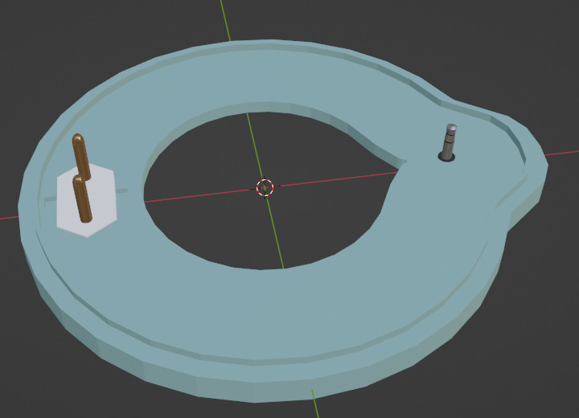

<table rules="none" width="90%" align="center">
<tr>
    <td></td>
    <td style="text-align: justify;vertical-align: top;"><b>
    

    INSTITUTO FEDERAL DE EDUCAÇÃO, CIÊNCIA E TECNOLOGIA DE SANTA CATARINA 
    CAMPUS FLORIANÓPOLIS 
    DEPARTAMENTO ACADÊMICO DE ELETRÔNICA 
    ENGENHARIA ELETRÔNICA 
    PROJETO INTEGRADOR III (PIN22107) - 2024/1

</b></td>
    <tr><td colspan="2" style="text-align: center;font-size: 8pt;"><b><i>
    Raquel Dutra Kotzias  
    Larah Farias Rodrigues Barboza  
    Ariel Rigueiras Montardo  
    </i></b></td></tr>
</table>

# 
Dispositivo para síntese de nanopartículas de Prata

Esse dispositivo tem como funcionalidade a produção de nanopartículas de prata através de um processo eletroquímico.

As nanopartículas por sua vez encontram sua utilidade em diversos campos, como o de  produtos  de  consumo (sabonetes, curativos, materiais têxteis) por conta de suas propriedades antimicrobianas, bem como biossensores e afins da biotecnologia [[3]](#ref3)

## Funcionalidades
As funcionalidades do dispositivo foram determinadas com base em duas publicações, ["Electrochemical method for the synthesis of silver nanoparticles"](#ref1) e ["Síntese e caracterização de nanopartículas de prata coloidais em solução aquosa para o estudo da supressão de fluorescência"](#ref2).

### Manter a temperatura da solução entre 50 e 80 °C
De acordo com KHAYDAROV et al. (2009), a temperatura ideal da reação para se obter uma solução mais estável é de valores entre 50 e 80 °C.

> In order to obtain stable silver nanoparticles with a concentration in the range of 20 to 40 mg/L, it was necessary to ensure a reaction time of 50–70 min in the temperature range of 50 to 80 C. (KHAYDAROV, 2009, p. 1196) [[1]](#ref1)

Decidimos que o usuário pode escolher a temperatura de operação do sistema sendo definido como padrão a temperatura de 70 graus celsius, que está dentro da faixa definida como ideal. 
Para aquecer a solução é utilizado um ebulidor comercial de 750 W. Para a quantidade de líquido utilizado aproximou-se que levará em torno de 7 minutos para que a solução esteja na temperatura ideal. Utilizando o sensor de temperatura DS18B20 o dispositivo controla um relé para manter a temperatura definida pelo usuário. O processo funcionará da seguinte forma: 
O sistema utiliza a informação de temperatura fornecida pelo termômetro para decidir se deve ou não acionar o aquecimento do sistema. O aquecimento é controlado com um relé, atuando como uma simples chave liga-desliga. Em software a decisão de aquecer ou não o sistema funciona com um a histerese (o sistema é aquecido até que a temperatura ultrapasse em cinco graus o valor escolhido e então permite que o sistema resfrie até que a temperatura atinja o valor escolhido pelo usuário). Para garantir a estabilidade desta parte do sistema se falha na leitura ou comunicação com o sensor de temperatura o sistema entra em um estado de erro onde o ebulidor é desligado incondicionalmente. O esquema para medição de temperatura é apresentado abaixo.

||
|:-:|
||
|<a id="fig-aq">**Figura ?** - Diagrama do sistema de aquecimento do dispostivo.</a>|

### Trocar a polaridade da tensão aplicada nos eletrodos a cada 240 segundos
Segundo KHAYDAROV et al. (2009) é necessária a troca de polaridade da tensão aplicada nos eletrodos para reduzir o depósito de óxido de prata nos eletrodos e assim tornar a reação mais eficiente.

> We varied the period of the polarity changes in the range of 30 to 300 s. It was found empirically that 4 min was an optimum period. At smaller values, agglomeration of particles in the solution was enhanced at the cost of silver film deposition at the cathode. For values of the period exceeding 4 min, a gradual decrease of the effective surface for the particle production occurred, owing to a significant growth of silver electrodeposition on the cathode. (KHAYDAROV, 2009, p. 1196) [[1]](#ref1)
	
O dispositivo realiza a troca de polaridade através de um circuito de ponte H controlado pelo microcontrolador para realizar não só a troca de polaridade, mas também para determinar quando a reação deve ser iniciada ou interrompida.

### Corrente nos eletrodos controlada em 10 mA
“Para que o processo ocorra adequadamente, é necessário controlar precisamente a corrente elétrica e mantê-la estável.” (PINHEIRO, et al., 2019, p. 2). Apesar da publicação de PINHEIRO, et al. (2019) não explicitar qual foi o valor de corrente utilizado, observamos nas imagens publicadas que o melhor resultado foi obtido com uma corrente de 10 mA. O dispositivo controla a corrente nos eletrodos utilizando uma fonte de corrente com o regulador LM317 de acordo com o diagrama abaixo.

### Agitar a solução
Para evitar a precipitação de prata durante a síntese KHAYDAROV, et al. (2009) sugere que a solução seja agitada intensivamente durante o processo.
 
> Additional technological keys to the electrochemical synthesis of silver nanoparticles lie in … and intensive stirring during the process of electrolysis to inhibit the formation of precipitates. (KHAYDAROV, 2009, p. 1194) [[1]](#ref1)

Este dispositivo obtém esta funcionalidade utilizando uma hélice acoplada a um motor DC. O nível de agitação causada pelo motor pode ser definido pelo usuário, o sistema então controla a velocidade do motor com modulação PWM. O controle PWM é feito através do Contador 2 do atmega328p configurado com modo de operação PWM com correção de fase e frequência de 31kHZ. A hélice feita de acrílico é acoplada ao motor DC através de uma haste, também feita de acrílico. 

### Interface com o usuário 
Além das funcionalidades focadas no desenvolvimento da prata coloidal, o sistema apresenta também algumas funções de qualidade de vida ao usuário. O dispositivo apresenta uma interface para modificação dos parâmetros de temperatura, tempo de operação, intervalo entre a troca de polaridades e velocidade do motor. Durante o processo de produção de prata coloidal a interface apresenta a temperatura do sistema, a intensidade e polaridade da corrente nos eletrodos , o tempo restante de operação, bem como o nível de velocidade do motor, este, que pode ser alterado a qualquer momento durante a operação. Todo o sistema utiliza o microcontrolador atmega328p para controle e interface. 
A medição da corrente que é apresentada ao usuário é feita através de um comparador que mede o valor de tensão sobre um resistor de valor conhecido que está em série com os eletrodos. O comparador foi projetado com ganho 20 e um offset de 2,5V, garantido assim que ao variar entre -12mA e 12mA a corrente sobre o resistor conhecido de 10ohms a tensão de saída do comparador varia entre 0V e 5V. A saída do comparador é então medida no ADC do microcontrolador e o valor medido é mapeado para o valor de corrente exibido ao usuário. O esquema de medição de corrente é apresentado na figura abaixo.
||
|:-:|
||
|Esquema para medição de corrente|

Para melhor definirmos como as informações seriam apresentadas ao usuário, foi feita uma simulação da interface a ser exibida no display lcd (https://www.figma.com/proto/vzXWbpWkbP1SS4rhWi7TBW/Figma-basics?t=otWXFPbx3BhwNBE5-1)

### Apresentação do produto 
Pensando em aquecer o sistema em banho maria, para não haver interferência da resistência na eletrólise, foi definida a utilização de 2 beckers, com duas tampas. 
A primeira tampa para segurar o becker menor dentro do maior sem que este encoste no fundo, conectado a ela apenas o sensor de temperatura e o ebulidor, e a segunda com todos os outros componentes. A segunda tampa também teria como objetivo segurar a haste e os eletrodos dentro da água no becker menor.
||||
|:-:|:-:|:-:|
|||

## Máquina de estados do processo

Pensando em atender todas as necessidades do processo foi feito o seguinte diagrama para ser utilizado como base para o desenvolvimento dentro da máquina de estados.

## Materiais

- [x] 1 béquer de 500mL
- [x] 1 béquer de 2L
- [x] 1 Haste (20 cm de altura)
- [x] 1 hélice (6 cm diametro, 2cm de altura)
- [x] 1 ebulidor 750 W
- [x] 1 Relé + acionamento
- [x] 1 Conversor CA/CC 5V 20W (HLK-20M5)
- [x] 1 Conversor CA/CC 24 03W (HLK-PM24)
- [x] 1 motor DC (3V 13100 RPM DC MOTOR) 
- [x] 1 sensor de temperatura (DS18B20)
- [x] 1 display 16x2 (5LC01)
- [x] 1 Ponte-H (L293N - 4 meia pontes)
- [x] 4 Ampops (LM324N - 4 ampops)
- [x] Regulador ajustável de tensão (LM317)
- [x] 1 Transistor para acionamento do relé (BC548B)
- [x] 1 diodo de roda livre para a bobina do relé (1N4001)
- [x] 1 Transistor para acionamento do motor DC (TIP122)
- [x] 1 diodo de roda livre para o motor (1n4007)
- [x] Resistores diversos

## Resultados

### Imagens

### Videos
Apresentação da interface do usuário, demonstrando definição da temperatura, velocidade do motor, e intervalo entre as trocas de polaridade.
https://github.com/ArielRM/PI3-IFSC-2024-1/blob/main/raquel_larah_ariel/assets/interface_usuario_480p.mp4

Demonstração da atuação do limitador sendo acionado.
https://github.com/ArielRM/PI3-IFSC-2024-1/blob/main/raquel_larah_ariel/assets/corrente_e_limitador.mp4

### Manter a temperatura da solução
Nos testes finais o sistema agiu como esperado mantendo a temperatura definida pelo usuário e entrando em estado de erro quando há falha de comunicação com o sensor.

### Trocar a polaridade da tensão aplicada nos eletrodos
Com base no valor de intervalo definido pelo usuário, o sistema realiza a troca de polaridade. Essa troca pode ser observada pelo usuário na parte de corrente da interface onde há a troca de sinal.

### Corrente nos eletrodos controlada em 10 mA
Diferente dos testes realizados a corrente demorou consideravelmente para alcançar o valor idealizado, supomos que a temperatura influenciou nesta demora pois ao habilitar o aquecimento o tempo de resposta do sistema reduziu de forma expressiva.

### Apresentação do produto
Tivemos dificuldade para encontrar conectores entre as duas tampas, decidimos utilizar um plug de tomada para o ebulidor e um p2 no sensor.

As tampas foram impressas, a tampa de baixo encaixou bem nos dois beckers a de cima precisaria de ajustes para acomodar melhor os componentes. Além disso, a disposição das conexões entre placas poderia ter sido melhor pensada já que encontramos durante a montagem como quebra de fio e de trilha que nós forçou a refazer as placas.

## Melhorias 
Ao longo dos testes finais identificamos algumas melhorias que podem ser feitas, são elas:

### Tampa
O modelo para impressão se beneficiaria de formatos pensados para robustez, em especial dos pontos de fixação das placas, mas também de espessura do topo e de margem para maior tolerância nos encaixes por conta das irregularidades da impressão.

### Eletrodo
O conector para segurar os eletrodos poderia ser de mais fácil encaixe. A altura dos eletrodos teve de ser modificada para operar com as pás sem colisões.

### Pás
Ao unir o motor a haste e testar no becker com água, o giro da haste foi menor que o esperado, por conta disso modificamos o tamanho das pás e o material base e assim foi obtido um melhor resultado. 

## Referências

> <a id="ref1"/> [1] KHAYDAROV, R.A.; KHAYDAROV, R.R.; GAPUROVA, O. et al. Electrochemical method for the synthesis of silver nanoparticles. J Nanopart Res 11, 1193–1200 (2009). https://doi.org/10.1007/s11051-008-9513-x

> <a id="ref2"/> [2] PINHEIRO, A.; MANIA, E.; FERREIRA, E. S. Síntese e caracterização de nanopartículas de prata coloidais em solução aquosa para o estudo da supressão de fluorescência. n. 24 (2020): XXIV Seminário de Iniciação Científica. https://doi.org/10.13102/semic.vi24.7130

> <a id="ref3"/> [3] Garcia, D. G., Santos, K. O., Freitas, K. F. D., Cardoso, M. J. B., & Fook, M. V. L. (2021). Síntese de Nanopartículas de Prata pela Técnica de Eletrodeposição para Desenvolvimento de Biossensores / Synthesis of Silver Nanoparticles by Electrodeposition Technique for Biosensor Development. Brazilian Journal of Development, 7(3), 31130–31145. https://doi.org/10.34117/bjdv7n3-709

> <a id=”ref4”/> [4] Hill, Hudgins, Eckles, et al. An Engineer’s Guide to Current Sensing. Texas Instruments.  https://www.ti.com/lit/eb/slyy154b/slyy154b.pdf?ts=1725600552393
