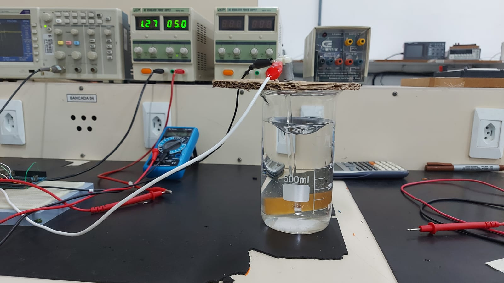
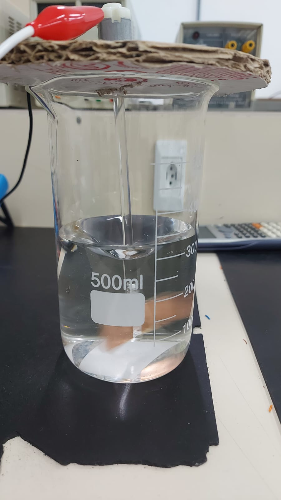

## Teste funcionalidade da tampa de apoio
Foram feitos 2 prototipos sendo o primeiro em papelão ([Figura 1](#fig-tampa-em-papelao)) com o proposito de verificar encaixes e resistencia. E o segundo em madeira ([Figura 2](#fig-tampa-em-madeira)) para vibializar o teste de temperatura.

||
|:-:|
||
|<a id="fig-tampa-em-papelao">**Figura 1** - Tampa em Papelão </a>|

||
|:-:|
||
|<a id="fig-tampa-em-madeira">**Figura 2** - Tampa em Madeira </a>|

## Teste sensor de temperatura (DS18B20)

Foi realizado o teste do sensor utilizando o valor de tensão que haviamos projetado para o circuito, que até então era 3,3V, porém o sensor não funcionou nessa faixa de tensão. O teste foi repetido com 5V e assim foi possível estabelecer a comunicação com sucesso. Como alguns outros pontos do circuito também requisitam 5V decidimos trocar o microcontrolador e trabalhar com 5V em todo o circuito (exlcuindo o ebulidor, que funciona em 220 VAC, e os eletrodos, que utilizam 24 VDC) 

## Teste de transferencia de temperatura
Para o teste foi colocado 1 litro de água no becker externo e 500mL no interno. O ebulidor ficou no becker externo. Quando a temperatura da água no becker interno chegou a 60°C, a água no becker externo estava em 83°C.
Esse processo levou em torno de 7 minutos. Após desligado o ebulidor ambas as temperaturas elas se igualaram em torno de 70°C.

## Teste do motor DC (13100 RPM DC MOTOR)
Fizemos alguns testes para observar quais valores de pwm seriam bons de trabalhar. Os testes que fizemos foram feitos em 5V sem cuidado com a corrente o que causou a queima do motor. Defimos que deveriamos planejar uma limitação da corrente utilizando o proprio pwm, porem deveriamos esperar ate conhecermos melhor a carga do motor (haste + helice + água) para definiraos qual seria o valor limite.

|||
|:-:|:-:|
|||
|<a id="fig-motor_teste_5V">**Figura 3** - Teste do motor </a>|<a id="fig-motor_teste_5V_2">**Figura 4** - Teste do motor 2 </a>|

## Teste de fonte de corrente + ponte-H
Testamos a integração entre a fonte de corrente utilizando o LM317 e a ponte H L293N da mesma forma que pretendemos utiliza-las no nosso sistema. Obtivemos os seguintes resuldados de corrente na carga e na entrada do bloco para o sentido positivo de corrente na ponte-H:
|R ($\Omega$) |Il(mA)  |Ii(mA)   |
|---|----|-----|
|987|9,96|11,96|
|1506|9,96|11,96|
|1906|9,95|11,95|

e os seguintes valores para o sentido negativo na ponte-H:
|R ($\Omega$) |Il(mA)  |Ii(mA)   |
|---|----|-----|
|987|10,08|11,96|
|1506|10,08|11,96|
|1906|10,08|11,95|

Verificamos então que se quisermos obter uma corrente de 10mA no ramo central da ponte devemos projetar a fonte de corrente para aproximadamanete 12mA, isso é provavelmente causado pelas correntes de polarização dos transistores internos da ponte-H

## Teste da corrente nos eletrodos
Para o teste foi colocado 500m de água desmineralizada no becker interno. A distância entre os eletrodos foi ajustada até a obtenção dos 10mA aproximados necessários para o processo de eletrólise continuo da prata em solução aquosa.

Esse processo levou em torno de 5 minutos. Sendo o momento inicial de ionização o mais demorado, pois após o primeiro momento com corrente na faixa de 10mA mesmo com a inversão dos pólos o tempo para estabilizar novamente em 10mA foi menor.

## Primeiro teste de integração do sistema

A parte lógica apresentou bom funcionamento, com respostas corretas ao acionamento dos botões e leitura do sensor de temperatura, porém o sinal de PWM foi inconsistente.
Quanto a parte física, inicialmente a placa inferior funcionou mas durante a montagem foram necessários manipulações que levaram a placa a apresentar curto na alimentação 5V
